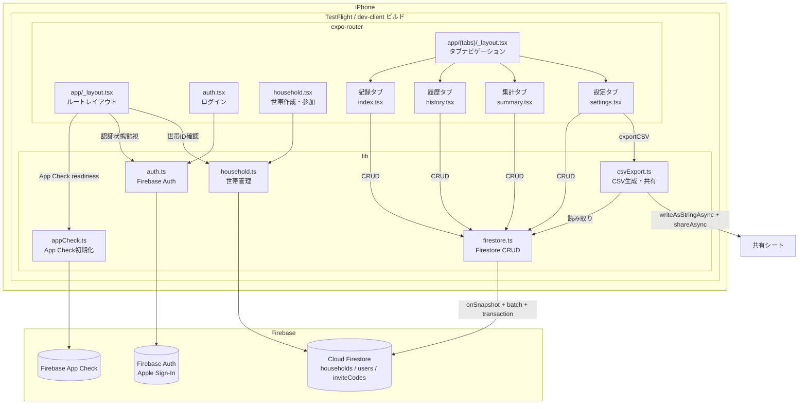
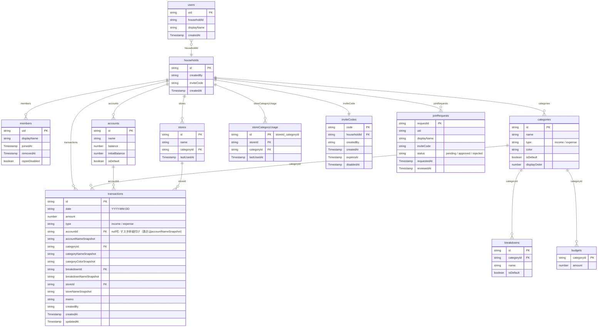
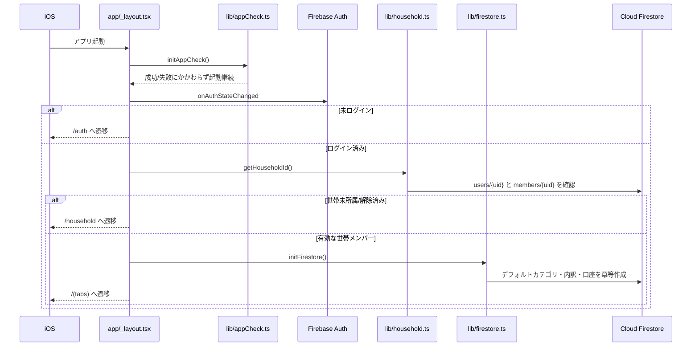
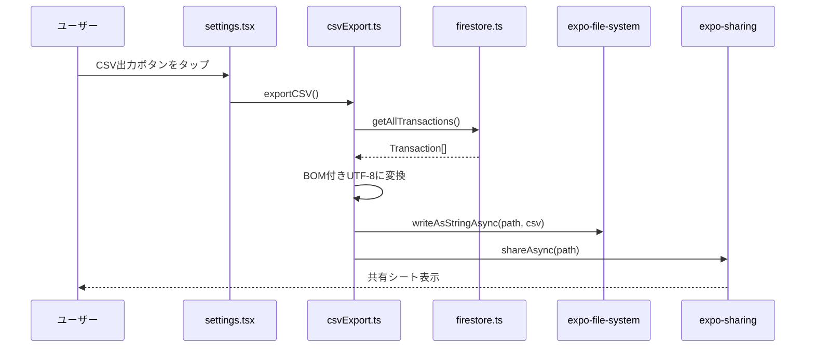
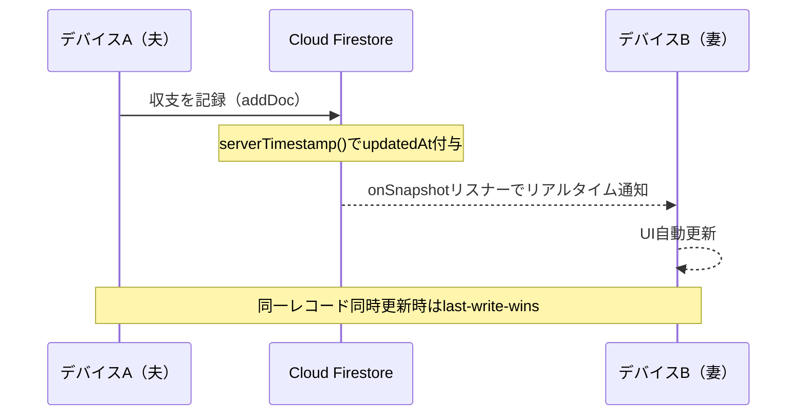

# moneyplanner — アーキテクチャ概要

## 全体構成



---

## 画面構成（4タブ）


| タブ | ファイル                  | 主な機能                                 |
| ---- | ------------------------- | ---------------------------------------- |
| 記録 | `app/(tabs)/index.tsx`    | 収支入力フォーム・カテゴリ選択・日付入力 |
| 履歴 | `app/(tabs)/history.tsx`  | リスト表示・カレンダービュー             |
| 集計 | `app/(tabs)/summary.tsx`  | 月次・年次・カテゴリ別集計               |
| 設定 | `app/(tabs)/settings.tsx` | カテゴリ管理・CSV出力・世帯管理          |

---

## データベース設計



### Firestore コレクション詳細

```text
/users/{userId}
    - householdId: string
    - displayName: string
    - createdAt: Timestamp
    - inviteJoinFailedAttempts?: number （招待コード失敗回数）
    - inviteJoinCooldownUntil?: Timestamp （クールダウン終了時刻）
    - inviteJoinLastFailedAt?: Timestamp

/inviteCodes/{code}                              # トップレベルコレクション
    - householdId: string
    - createdBy: string
    - createdAt: Timestamp
    - expiresAt: Timestamp
    - disabledAt?: Timestamp

/households/{householdId}
    - createdBy: string (userId)
    - inviteCode: string (6文字、参加用)
    - createdAt: Timestamp

    # 以下、すべて /households/{householdId} 配下のサブコレクション

    /members/{userId}
        - displayName: string
        - joinedAt: Timestamp
        - removedAt?: Timestamp
        - rejoinDisabled?: boolean （解除済みメンバーの再参加抑止フラグ）

    /joinRequests/{requestId} （参加承認フローで使用中）
        - uid: string
        - displayName: string
        - inviteCode: string
        - status: pending | approved | rejected
        - requestedAt, reviewedAt?: Timestamp

    /categories/{categoryId}
        - name, type, color, isDefault, displayOrder
        - updatedAt: Timestamp

    /breakdowns/{breakdownId}
        - categoryId, name, isDefault
        - updatedAt: Timestamp

    /transactions/{transactionId}
        - date, amount, type, accountId, categoryId, breakdownId, storeId
        - accountNameSnapshot, categoryNameSnapshot, categoryColorSnapshot
        - breakdownNameSnapshot, storeNameSnapshot
        - memo, createdAt, updatedAt: Timestamp
        - createdBy: string (userId)

    /accounts/{accountId}
        - name, balance, initialBalance, isDefault
        - createdAt, updatedAt: Timestamp

    /stores/{storeId}
        - name, categoryId, lastUsedAt: Timestamp

    /storeCategoryUsage/{storeId_categoryId}
        - storeId, categoryId, lastUsedAt: Timestamp

    /budgets/{categoryId}
        - categoryId, amount
        - updatedAt: Timestamp
```

### デフォルトカテゴリ

| 種別 | カテゴリ                                                                     |
| ---- | ---------------------------------------------------------------------------- |
| 収入 | 給与所得・賞与・臨時収入・配当金                                             |
| 支出 | 食費・日用雑貨・住まい・通信・交通・教育・クルマ・税金・大型出費・その他など |

### 月次日付レンジ方針

- 取引・予算系の月次クエリは `YYYY-MM-31` 固定ではなく、`lib/yearMonthDateRange.ts` で開始日・終了日を生成する
- 2月、うるう年を含む月境界を同一ルールで扱い、`lib/yearMonthDateRange.test.ts` で検証する

---

## Firestore初期化フロー



> **重要**: `lib/database.ts` / `expo-sqlite` は撤去済み。Firestore初期化は認証・世帯確認後に `initFirestore()` で行う。

---

## CSV出力フロー



---

## Phase 3: Firebase同期



- **同期方式**: Cloud Firestoreリアルタイムリスナー（`onSnapshot`）
- **オフライン**: Firestore内蔵のオフライン永続化で自動対応
- **認証**: Apple Sign-In + Firebase Auth
- **世帯共有**: 招待コード方式、6文字コードで家族が同一世帯に参加
- **競合解決**: `serverTimestamp()` による last-write-wins
- **実装要件**: expo-dev-client + React Native Firebase + EAS Build

---

## ファイルツリー

詳細なファイル単位の役割はコードを正とし、ここでは主要ディレクトリの責務だけを示す。

```text
moneyplanner/
├── app/                     # expo-routerのルート（auth, household, (tabs)/...、dev-ui-preview）
├── lib/                     # ドメインロジック（Firestore CRUD、認証、世帯、集計、CSV、入力検証など）
├── components/              # 再利用UIコンポーネント（TransactionEditor、MoneyInputModal等）
├── constants/               # カラーパレット、固定値
├── hooks/                   # useFirestore（リアルタイムリスナー）、useColorScheme等
├── assets/                  # フォント、アイコン
├── firestore.rules          # Firestore Security Rules
├── firestore.rules.test.ts  # Rules エミュレータテスト
├── firebase.json            # Firestore Emulator設定
├── app.config.js            # EAS secret から GoogleService-Info.plist 注入
├── eas.json                 # EAS Build プロファイル（development/preview/production）
├── PLAN.md                  # 進捗とタスク
├── README.md                # プロジェクト概要・ドキュメント目次
└── ARCHITECTURE.md          # このファイル
```

主要モジュールの責務:

| ディレクトリ/ファイル                                      | 責務                                                                  |
| ---------------------------------------------------------- | --------------------------------------------------------------------- |
| `lib/firestore.ts`                                         | Firestore CRUD 全体（取引/カテゴリ/口座/予算/世帯設定）と型定義の中心 |
| `lib/auth.ts`                                              | Firebase Auth + Apple Sign-In                                         |
| `lib/household.ts`                                         | 世帯作成・招待コード・参加リクエスト・メンバー管理                    |
| `lib/summaryAggregation.ts`                                | 月次/年次集計・予算進捗の純関数集計ロジック                           |
| `lib/csvExport.ts`                                         | CSV生成・共有                                                         |
| `lib/csvImport.ts`                                         | CSV取り込み（検証は `csvImportParse.ts`、マスタ解決は Resolve に分離）|
| `lib/historySearch.ts`                                     | 履歴フィルタリング条件                                                |
| `lib/moneyInput.ts`                                        | 金額入力の正規化・四則演算評価                                        |
| `hooks/useFirestore.ts`                                    | Firestore リアルタイム購読 + fromCache メタデータ                     |
| `components/TransactionEditor.tsx`                         | 記録/履歴編集の共通フォーム                                           |
| `components/MoneyInputModal.tsx` / `NumericInputModal.tsx` | 金額・数値入力モーダル（共通部品）                                    |
| `components/HistorySearchPanel.tsx`                        | 履歴の検索条件パネル                                                  |
| `components/ProgressOverlay.tsx`                           | 重い処理用の進捗オーバーレイ（CSV取り込み等。件数表示/不明の2モード） |

---

## 技術スタック

| 用途           | パッケージ                                          | バージョン                 |
| -------------- | --------------------------------------------------- | -------------------------- |
| フレームワーク | Expo                                                | ~54.0.0                    |
| UI             | React Native                                        | 0.81.5                     |
| ルーティング   | expo-router                                         | ~6.0.23                    |
| DB             | Cloud Firestore                                     | 世帯単位のリアルタイム同期 |
| 認証           | Apple Sign-In + Firebase Auth                       | 世帯共有                   |
| Firebase       | @react-native-firebase/app/auth/firestore/app-check | ネイティブSDK              |
| ビルド         | expo-dev-client + EAS Build / TestFlight            | iOS実機検証                |
| CSV出力        | expo-file-system/legacy                             | ~19.0.21                   |
| 共有           | expo-sharing                                        | ~14.0.8                    |
| 日付入力       | @react-native-community/datetimepicker              | 8.4.4                      |
| アニメーション | react-native-reanimated                             | ~4.1.1                     |
